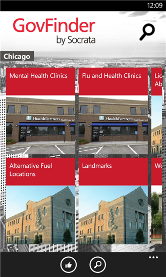

# GovFinder by Socrata for WP8

GovFinder by Socrata uses city-provided open data to allow citizens to find, and comment on, important data and services provided by their city.  GovFinder currently supports several cities and new cities and data are added regularly.

Download and install the full application from its [entry in the Windows Phone Store](http://www.windowsphone.com/en-us/store/app/govfinder/20b183d9-1f13-4606-84c3-072e96943ada)
